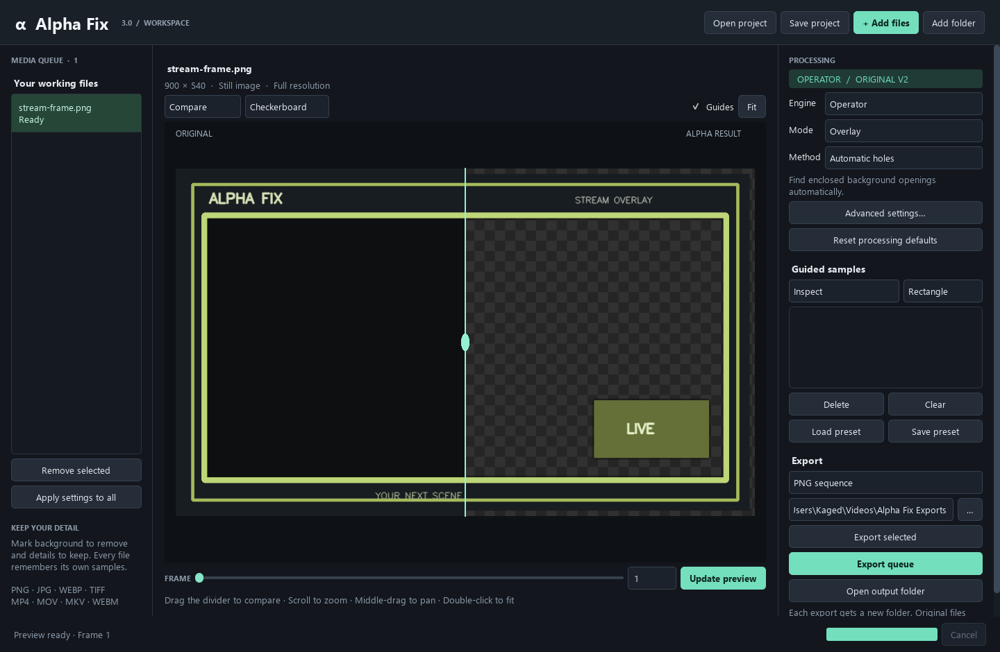

# Alpha Fix 3

A rewrite of Alpha Fix's desktop interface, project model, media handling and export service. The original operator and research algorithms are preserved. See `docs/REWRITE.md` for migration and verification details.

Double-click **Alpha Fix.lnk** or **Alpha Fix.vbs** to open the app without a console. The environment and shortcut are already prepared in this folder. On a new machine, run **Setup.bat** to install dependencies using uv. **Alpha Fix.bat** starts the app with console diagnostics.

```powershell
uv sync
uv run alpha-fix --gui
uv run alpha-fix --help
uv run pytest
```

Open `examples/Demo.afix` from **Open project** to try the included geometric stream overlay.

1. Add images, videos, or a folder. Select a file in the queue.
2. Choose **Operator** for the original v2 methods or **Research** for the original v1 methods.
3. Choose a sample tool and drag on the source. Use **Update preview** after changing settings or samples.
4. Compare the result, inspect the alpha matte, or scrub to another frame. Scroll to zoom and middle-drag to pan.
5. Choose a destination and export the selected file or the whole queue. Each run creates a new folder.
6. Save an `.afix` project to retain all file settings and samples. **Load preset** accepts old sample JSON.

Research **Bounded geodesic** needs both a basin and a background sample to remove anything. **Advanced settings** exposes the original algorithm controls. **Apply settings to all** copies the selected file's settings and samples to every queued file.

Command-line examples:

```powershell
uv run alpha-fix --input "input.mp4" --output ".\exports" --mode subject
uv run alpha-fix --input "input.png" --output ".\exports" --sample-preset "samples.json"
uv run alpha-fix --input "media-folder" --output ".\exports" --export-format webm_alpha
uv run alpha-fix --project "my-project.afix"
uv run alpha-fix --input "input.png" --output ".\exports" --set despill_enabled=false
```

FFmpeg on PATH is required for video formats. PNG sequences require no external encoder. Video exports omit audio and use the reported source frame rate. See [rewrite details](docs/REWRITE.md) for architecture, compatibility and verification.


